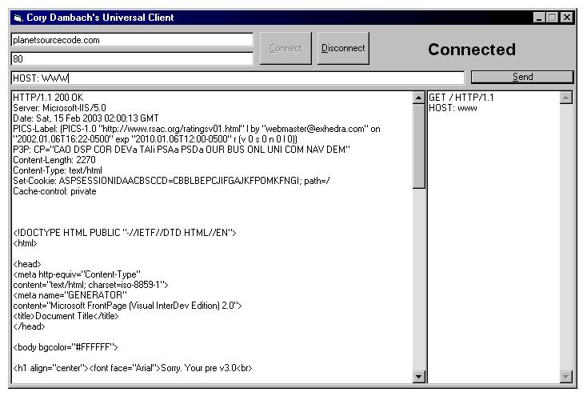



## Client Sample Program/Tutorial Graphical Telnet\!

### Description

This is to show you how to make your very own Telnet or client program.
 
### More Info
 

             |
---                |---
**Submitted On**   |2003-02-14 07:55:06
**By**             |[JokerDoom](https://github.com/Planet-Source-Code/PSCIndex/blob/master/ByAuthor/jokerdoom.md)
**Level**          |Beginner
**User Rating**    |4.0 (36 globes from 9 users)
**Compatibility**  |VB 5\.0, VB 6\.0
**Category**       |[Internet/ HTML](https://github.com/Planet-Source-Code/PSCIndex/blob/master/ByCategory/internet-html__1-34.md)
**World**          |[Visual Basic](https://github.com/Planet-Source-Code/PSCIndex/blob/master/ByWorld/visual-basic.md)
**Archive File**   |[Client\_Sam1544402142003\.zip](https://github.com/Planet-Source-Code/jokerdoom-client-sample-program-tutorial-graphical-telnet__1-43213/archive/master.zip)

### Source Code

<h1>Instructions</h1>
<h1>Download the Sample Code</h3>
<h3>Use the program</h3>
<h3>Read the comments</h3>
<h3>Vote For me</h3>
  
<h1>Your Feedback is GREATLY appreciated.</h2>

